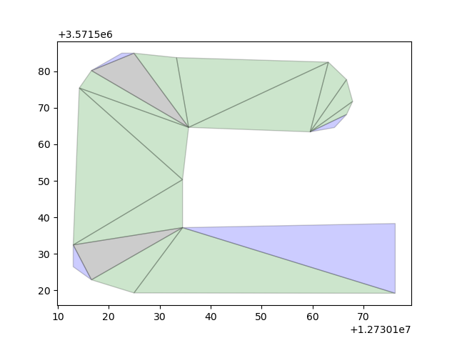
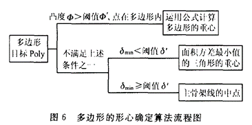
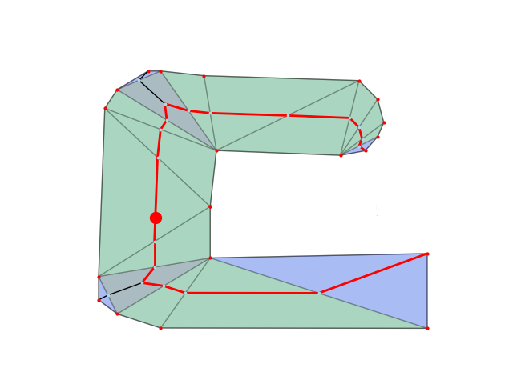

# 一种基于多边形骨架线的形心自动获取方式

> 本文基于以下文章并进行修改：
> 陈涛,艾廷华.多边形骨架线与形心自动搜寻算法研究[J].武汉大学学报(信息科学版),2004,(05):443-446+455.

## 主要内容
利用Delauney三角网计算主骨架线及形心

####  1. 多边形内部约束三角网的构建
首先计算多边形内部的Delauney三角网。对多边形边界所有的点进行计算Delauney三角网，只保留多边形内部的三角形。

多边形内部的三角形，细分为三类：

- 1类三角形：三角网中的边界节点，其3个顶点中有一个顶点作为骨架线的端点；
- 2类三角形：三角网中的跨接三角形，是骨架线的骨干结构，反映了骨架线的延展方向；
- 3类三角形：骨架分支的交汇处，向3方向伸展的出发点。


如图所示，紫色为1类三角形，绿色为2类，灰色为3类。

####  2. 三角网条件序贯遍历及骨架线树结构建立
 生成骨架线：**从角落向中间提取，逐渐消减分支**
 
 首先遍历所有的第1类三角形，生成此类三角形至第3类三角形的骨架线，将这条骨架线删除。
 之后根据这种方法循环调用，第三类三角形逐渐变为第1，2类三角形，直到处理完成所有骨架线。
 
####  3. 主骨架线的提取
 将所有骨架线生成一个无向图，寻找无向图中最长的边。
 
####   4. 多边形形心确定

综上，多边形形心的计算过程为：

1. **计算多边形凸度**：凸度大于阈值时，采用重心计算公式来计算；凸度小于阈值时，继续第二步；

2. **计算方差最小的第3类三角形**：构建三角网，计算三类三角形，求方差。若方差最小的三角形对应的方差小于阈值，说明这个三角形各个部分面积均衡，没有明显的主体部分，将这个第3类三角形的重心作为形心；若方差大于阈值，求主骨架线，将主骨架线的中点作为多边形的形心。


	本函数中凸度的阈值取值为0.85；方差的阈值取值为0.65


生成的形心结果（红色点）


## 代码使用
在 `incenter.py` 文件中最下边两行调用函数：
```
incenter = main(None) 
# 这里main函数中已经有读取shp文件的代码
# 如果想修改shp文件可以在main函数中的file_name = 'path/to/your/file.shp'中修改
print(incenter)
# 会输出一个Point类型的点
```
